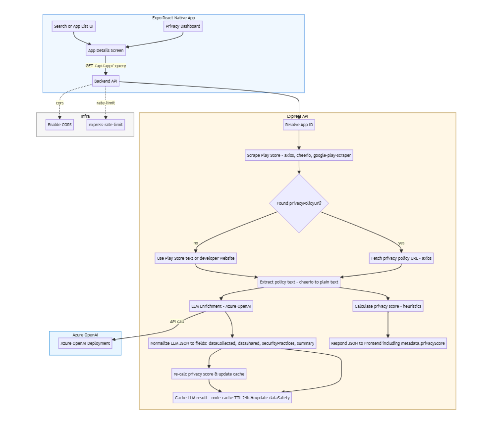

# PrivacyLens

PrivacyLens is a small web + backend app that analyzes mobile app privacy policies and Play Store metadata, enhances them using an LLM (Azure OpenAI), and surfaces a concise 4-bullet privacy summary in the UI.

## Highlights
- Server-side scraping of Google Play metadata and privacy policy.
- LLM-based extraction and summarization (Azure OpenAI) with server-side normalization.
- Caching of LLM results to control cost (24h TTL).
- Robust fallback when policy scraping is blocked: developer website and Play Store page text are analyzed by the LLM.

## Architecture



The diagram above shows the request flow: Frontend → Backend → (Play Store scraper / privacy policy fetcher). If a direct policy is available it's parsed and optionally enhanced with the LLM; if blocked, the backend uses the developer site or Play Store text as a fallback input to the LLM. Results are normalized and cached before returning to the frontend.

## Quickstart (Windows / PowerShell)

1. Clone and open the repo (you already have it):

```powershell
cd D:\PrivacyLens
```

2. Backend

- Install dependencies and set environment variables. Do not commit `.env` — it is already ignored.

```powershell
cd backend
npm install
# Set required environment variables (PowerShell example). Replace with your values:
$env:AZURE_OPENAI_KEY = "<your-key>"
$env:AZURE_OPENAI_ENDPOINT = "https://your-resource.openai.azure.com"
$env:AZURE_OPENAI_DEPLOYMENT = "your-deployment-name"
# (optional) $env:AZURE_OPENAI_API_VERSION = "2023-05-15" or as configured

# Start backend
npm run dev   # or: node server.js
# Backend runs on http://localhost:3000 by default
# But mine is on http://localhost:4002 -- adjust FRONTEND env var accordingly due to port conflicts
```

3. Frontend

```powershell
cd ..\frontend
npm install
npm run start
# Open the Expo/React web UI (usually http://localhost:8081 or indicated in terminal)
```

## Important env vars
- AZURE_OPENAI_KEY — API key (server-only secret)
- AZURE_OPENAI_ENDPOINT — Azure OpenAI endpoint URL
- AZURE_OPENAI_DEPLOYMENT — deployment name to use for chat/completions
- (Optional) AZURE_OPENAI_API_VERSION — API version; defaults are present in code

Keep these values in `backend/.env` locally (already ignored by git).

## API (backend)
- GET /health — service health
- GET /api/app/:query — returns app metadata + dataSafety. Example response highlights:
  - `metadata.privacyScore` (Number)
  - `dataSafety.dataCollected` (array)
  - `dataSafety.dataShared` (array)
  - `dataSafety.securityPractices.__llmSummary` — array of exactly 4 summary strings (LLM-derived)

Example: `/api/app/facebook` → JSON with `metadata` and `dataSafety.securityPractices.__llmSummary`

## Notes on behavior
- LLM enrichment is performed server-side and normalized so the frontend receives a consistent shape (summary = 4 bullet strings).
- LLM outputs are cached for 24 hours to reduce costs and rate pressure.
- When direct policy scraping is blocked (HTTP 403 or similar), the backend attempts:
  1. Fetch the developer website privacy page, if available
  2. If not available, send the Play Store page text to the LLM as fallback and mark the result as inferred
- The frontend shows a small attribution or fallback message when the summary was inferred from fallback content.

## Development tips
- If `git push` is rejected, rebase onto `origin/main`:

```powershell
git fetch origin
git pull --rebase origin main
# resolve any conflicts, then:
git push origin main
```

- Keep your `backend/.env` local and never commit it. The repository already adds `backend/.env` to `.gitignore`.

## Next steps / ideas
- Add an explicit opt-in flag for LLM enrichment (e.g. `?enhance=true`) to control costs and consent.
- Add unit/integration tests that mock LLM responses to verify normalization (summary array length, fields present).
- Add attribution UI enhancements when summaries are inferred (not direct policy text).

## License
This project is provided as-is for educational and prototyping use.


---
Generated README for the PrivacyLens codebase. If you want a shorter or longer variant, or a PNG/SVG architecture image added, tell me which style (text + mermaid vs. raster image) and I can add it. 